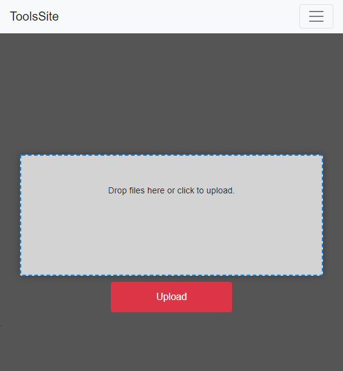
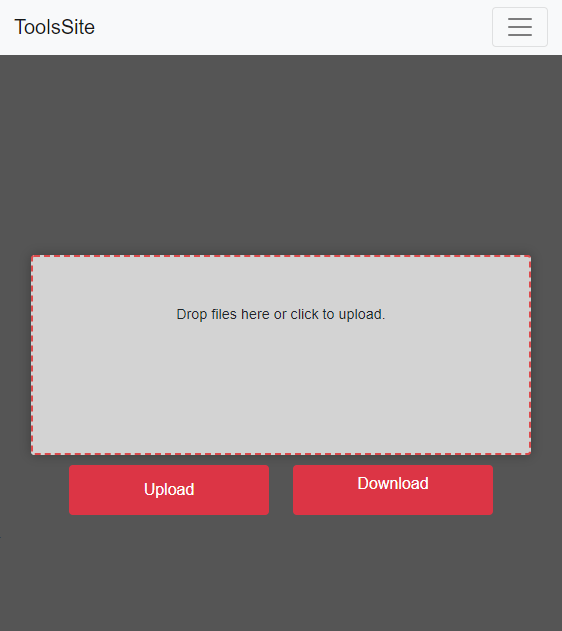
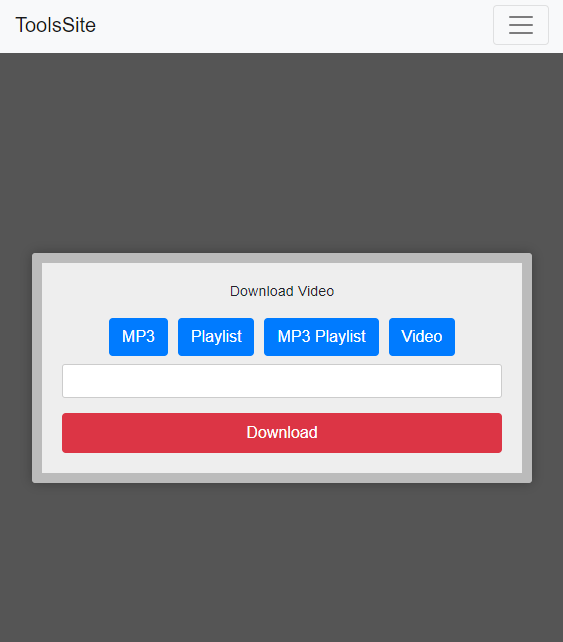

# ToolsSite
Simple Flask web app which contains some usefull tools.
Note that this Website was meant mostly for learning of Github Projects and merges in collaboration but it can serve you as well

For example :

Rotating and merging PDF files:

Converting DOCX Files 2 PDF:

Downloading YouTube Videos and Playlists: 

Run
---

::

    $ export FLASK_APP=core
    $ export FLASK_ENV=development
    $ flask run

Or on Windows cmd::

    > set FLASK_APP=core
    > set FLASK_ENV=development
    > flask run

Open http://127.0.0.1:5000 in a browser.

This Flask application is Dockerized now and you can run it easily with use of docker by launching in cmd/bash ::
   
    > docker-compose up